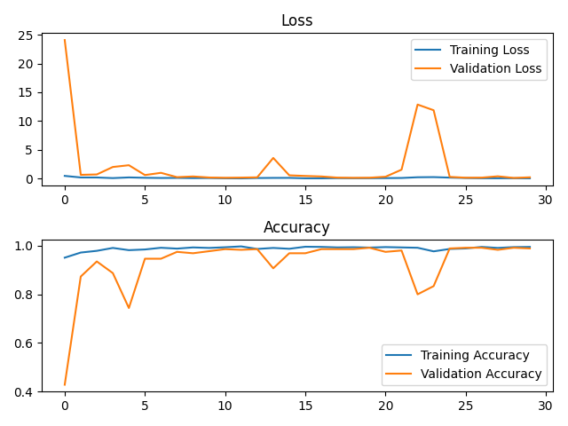
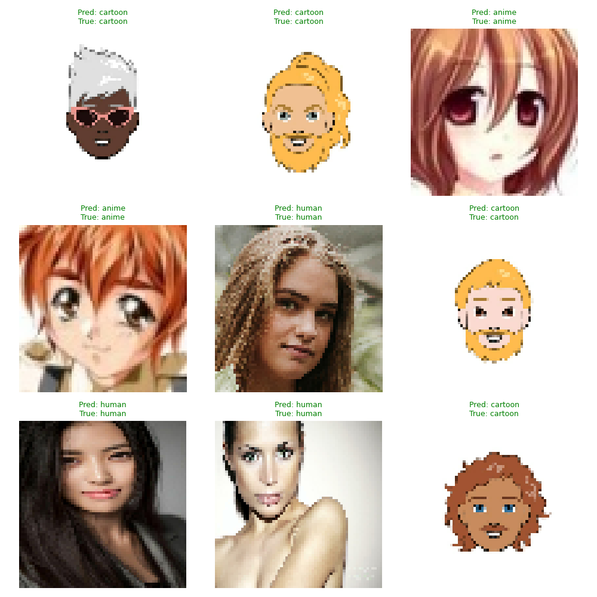

# Anime-Cartoon-Human Face Detector 

A multi-class face image classifier that predicts whether an input image contains an **anime**, **cartoon**, or **real human** face using a Convolutional Neural Network (CNN).

---

## Dataset

This project uses custom-sampled data from Kaggle sources:

- **Anime Faces** – from [`splcher/animefacedataset`](https://www.kaggle.com/datasets/splcher/animefacedataset)
- **Cartoon Faces** – from [`alhumayri/cartoon-classifier`](https://www.kaggle.com/datasets/alhumayri/cartoon-classifier)
- **Human Faces** – from [`ashwingupta3012/real-human-faces`](https://www.kaggle.com/datasets/ashwingupta3012/real-human-faces)

Each category is stored in:
dataset/
├── anime/
├── cartoon/
└── human/

---

## Features

- Custom CNN with Conv2D, BatchNorm, Dropout, and Dense layers
- 3-class classification: Anime, Cartoon, Human
- Auto-sampled datasets via script
- Accuracy/loss plots & .txt training summaries
- Grid visual showing prediction on 9 random faces
- Clean `.gitignore` and modular repo layout

---

## Training Results (2000 sample test)

**Final Metrics:**
- **Training Accuracy:** ~99.2%
- **Validation Accuracy:** ~97.8%
- **Loss:** ~0.02 (train), ~0.15 (val)

<p align="center">
  
</p>

---

## Sample Predictions

A 3x3 grid showing the model classifying unseen face samples:

<p align="center">
  
</p>

---

## Usage

### Step 1: Download Dataset
```bash
python utils/download_sample.py
```
### Step 2: Train the Model

```bash
python main.py
```
Trained model will be saved in:
```bash
model/face_classifier.keras
```
Summary saved to:
```bash
training/training_summary.txt
```
---

## Installation

1. Clone the repo  
   ```bash
   git clone https://github.com/Techdudetony/anime-cartoon-human-face-detector.git
   cd anime-cartoon-human-face-detector
   ```

2. Create a virtual environment (*if not already present*)
    ```bash
    python -m venv .venv
    source .venv/bin/activate # On Windows use: .venv\Scripts\activate
    ```

3. Install dependencies
    ```bash
    pip install -r requirements.txt
    ```
---

## Project Structure
├── dataset/                 ← Sampled anime/cartoon/human faces
├── inference/              ← Output prediction images
├── model/                  ← Saved model (.keras)
├── training/               ← Training plots & summary
├── utils/                  ← Data download script
├── main.py                 ← Training pipeline
├── README.md               ← You’re reading it!
└── .gitignore              ← Excludes datasets, models, etc.

---

## License

This project is licensed under the [MIT License](LICENSE) © [Techdudetony](https://github.com/Techdudetony)

---

## Acknowledgements

- [Kaggle](https://www.kaggle.com/) for the datasets  
- `kagglehub` for simplified API access  
- [TensorFlow/Keras](https://www.tensorflow.org/)
- You, the reader, for exploring this repo! 😊
